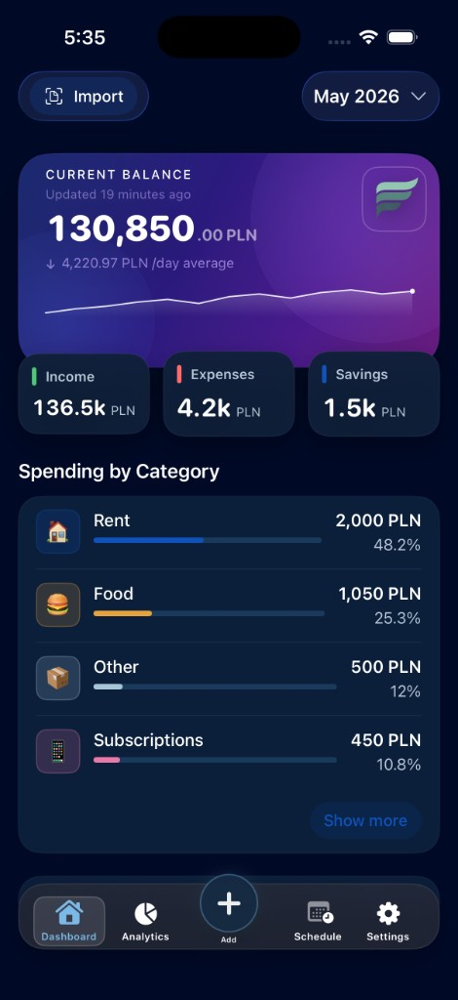
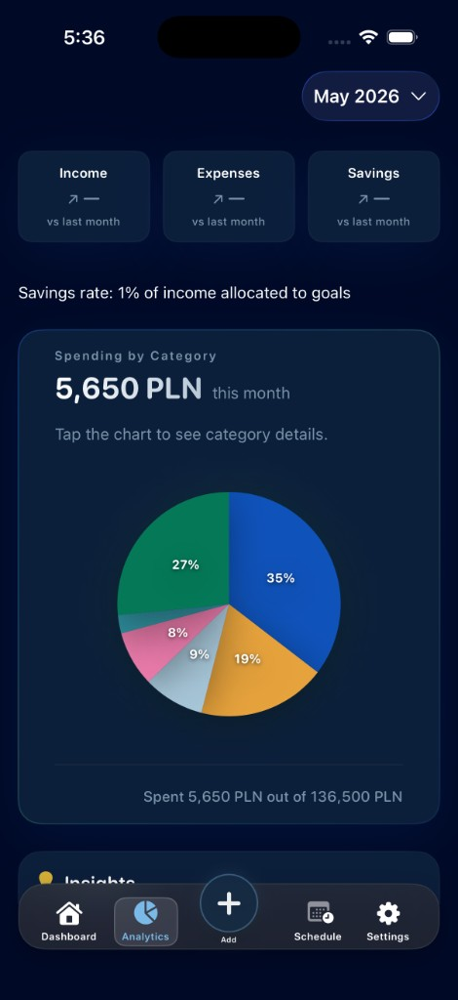
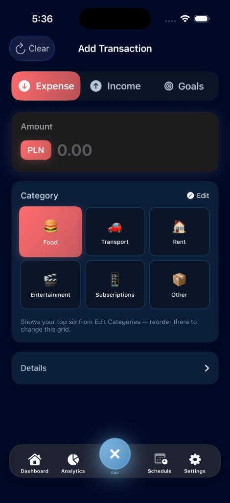
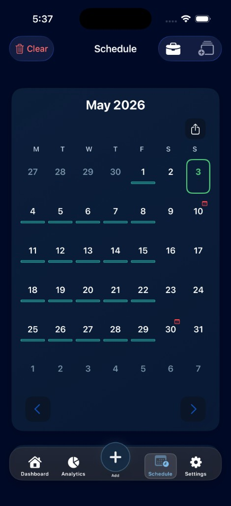

# Friscora

Native **SwiftUI** iPhone app for personal finance (income, expenses, goals, analytics), work schedule and salary projection, optional bank **statement import** with **deterministic / rule-based** categorization (no ML in-app).

**This repo does not include** an AI or “financial intelligence” assistant, on-device LLMs, or a mock-AI layer.

## Screenshots

| Dashboard | Analytics |
|:-:|:-:|
|  |  |

| Add transaction | Schedule |
|:-:|:-:|
|  |  |

## Stack (technical snapshot)

| Area | Notes |
|------|--------|
| UI | SwiftUI, MVVM-oriented structure |
| Language / runtime | Swift 5; concurrency settings aligned with current Xcode (e.g. `MainActor` default isolation in project) |
| Minimum OS | **iOS 18.0** (see `IPHONEOS_DEPLOYMENT_TARGET` in Xcode) |
| Local data | Primarily **UserDefaults**; optional **iCloud Key-Value** where enabled |
| Backend (partial) | **Firebase** (Core, **Firestore**, **Auth**) — e.g. anonymous auth + Firestore for **schedule sharing**; `GoogleService-Info.plist` is local-only (see `.example` in repo / `.gitignore`) |
| Quality | Unit tests under `FriscoraTests/`; privacy manifest present for App Store expectations |
| i18n | `en`, `kk`, `pl`, `ru` string catalogs |

## For reviewers 

- **Senior iOS:** Expect SwiftUI composition, view models, services, and persistence boundaries suitable for a solo or small-team product codebase — not a tutorial sample.
- **HR / non-technical:** Production-style finance + productivity app; **no AI product** in this codebase; Firebase is used for **specific** sync/auth flows, not as a generic “AI backend.”

## Run locally

1. Open `Friscora.xcodeproj` in Xcode (current stable release recommended).
2. Provide `Friscora/GoogleService-Info.plist` for your Firebase project if you exercise Auth/Firestore features.
3. Build and run the **Friscora** target (iPhone; portrait-oriented app).

## License

MIT — see `LICENSE`.

## Author

Daulet Niyazov
